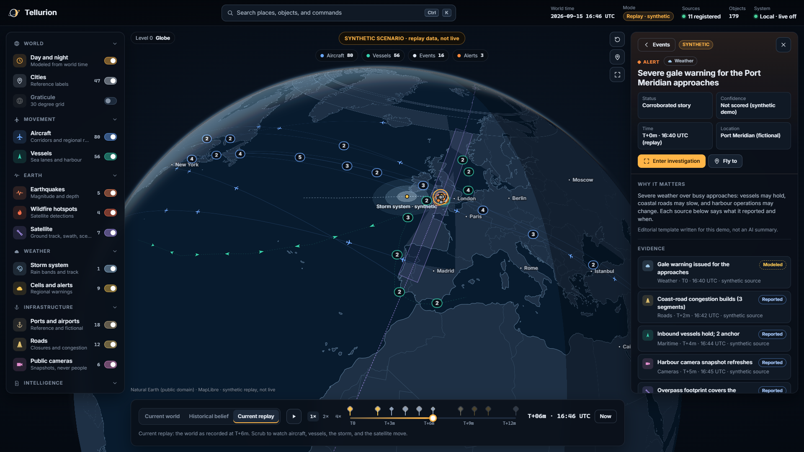
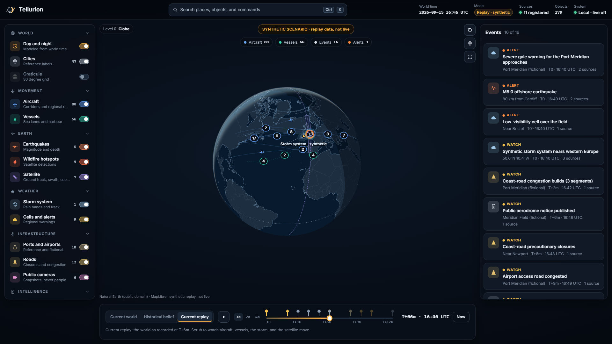
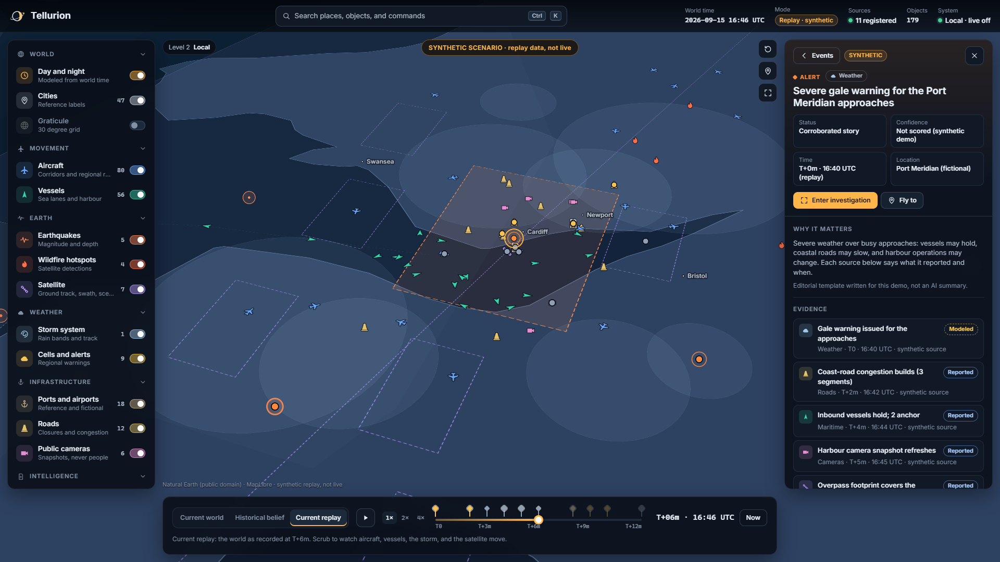
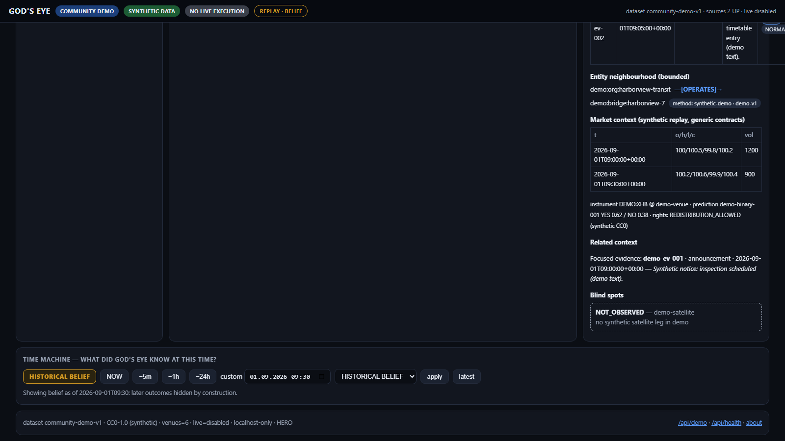
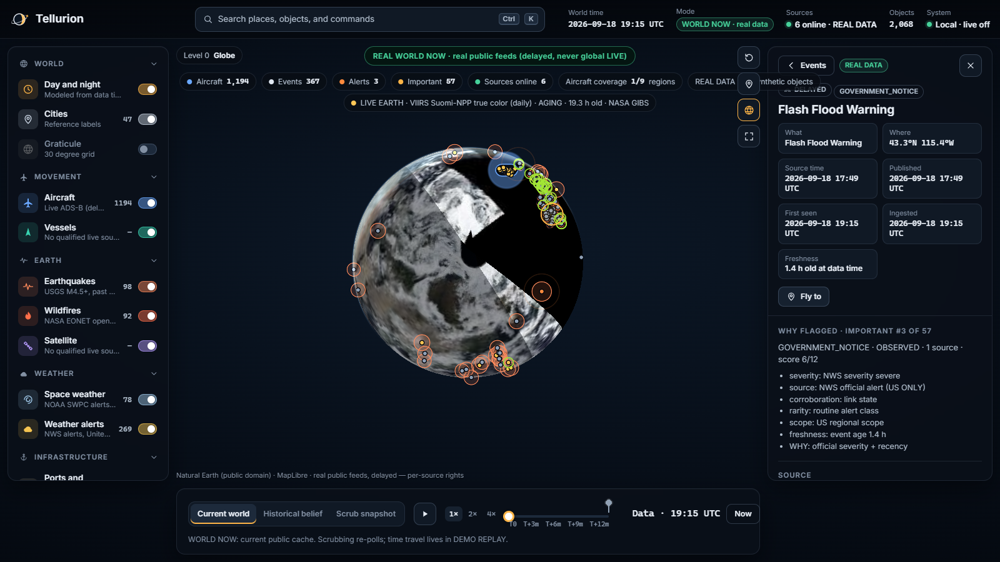
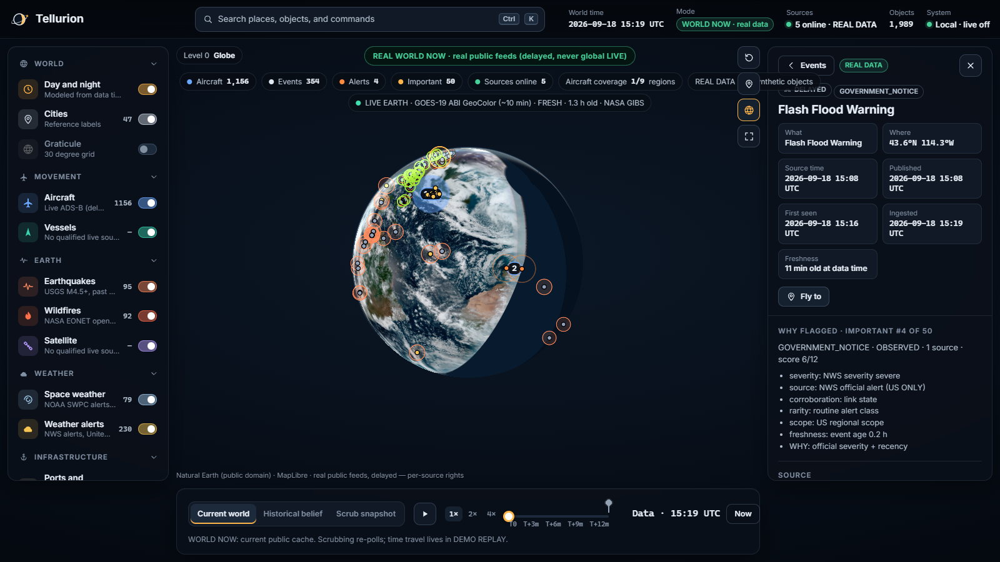
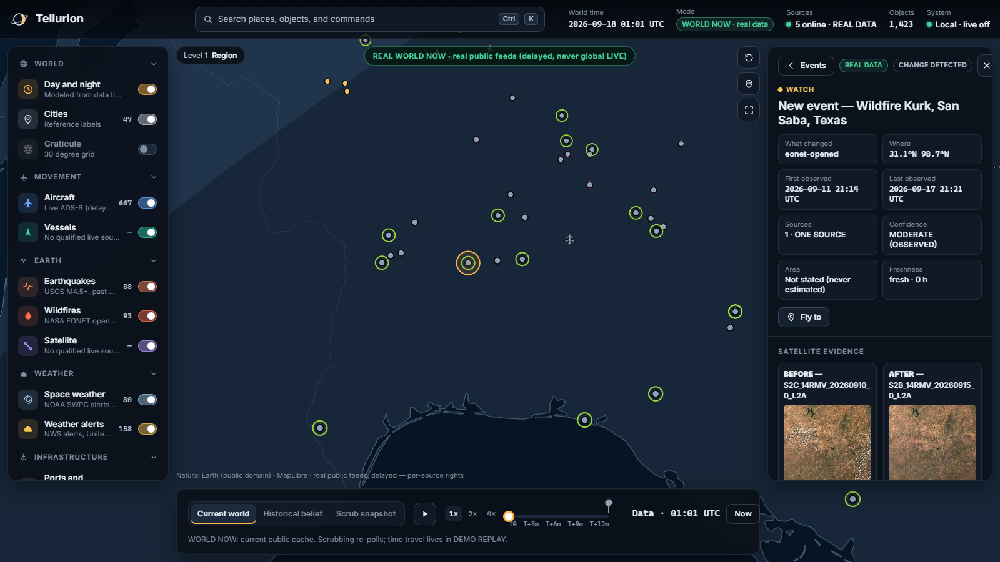

# Tellurion

**The state of the world, with its evidence attached.**

Open-source, local-first world intelligence from public data.

SEE WHAT CHANGED. KNOW WHEN IT CHANGED. VERIFY WHY IT MATTERS.

Tellurion combines WORLD NOW (real public feeds with evidence and
provenance), CHANGE_DETECTED (what changed, with before/after proof),
Sentinel-2 satellite evidence, NASA GIBS Live Earth imagery with explicit
freshness, Important Now public-interest ranking, replay / Time Machine,
and AI-readable world-state APIs. It runs on your machine; the replay demo
is fully offline on synthetic CC0 datasets, while WORLD NOW polls qualified
keyless public feeds.




`WORLD NOW` · `CHANGE_DETECTED` · `SATELLITE EVIDENCE` · `LIVE EARTH` ·
`IMPORTANT NOW` · `EVIDENCE` · `TIME MACHINE` · `AI API` · `PLUGINS`

## Run it in three commands

```bash
pip install -e .
tellurion doctor       # environment + boundary checks (no keys, no network)
tellurion ultra --hero # the globe, 127.0.0.1 only -> http://127.0.0.1:8765/ultra
```

No API keys. No telemetry. No live execution. The replay demo runs fully
offline on synthetic CC0 datasets (`community-demo-v1`, `ultra-demo-v1`);
WORLD NOW additionally polls qualified keyless public feeds (USGS, NWS,
SWPC, EONET, GDACS, GDELT, adsb.lol) with per-source rights shown in-app.
The command is also available as `godseye`.

**Licence:** MIT — see [`LICENSE`](LICENSE), [`NOTICE`](NOTICE), and the
maintainer sign-off record [`legal/LICENSE_SIGNOFF.md`](legal/LICENSE_SIGNOFF.md)
(owner's own decision, no external counsel review; third-party obligations
in `legal/THIRD_PARTY_NOTICES.md` stand on their own).

## What it looks like

| World surface | Evidence drawer | Time machine |
|---|---|---|
|  |  |  |

| LIVE EARTH | Change pins | Satellite evidence |
|---|---|---|
|  |  |  |

A Leaflet-based flat view is kept as a fallback at `/ultra/classic`; the
renderer decision is measured in [`docs/design/world-renderer-decision.md`](docs/design/world-renderer-decision.md).

## The world surface

`http://127.0.0.1:8765/ultra` — a globe you can interrogate.

- **Semantic zoom.** Continent counts resolve into regional clusters, then
  into individual aircraft, vessels, satellite passes, and weather as you
  descend. Camera presets (`1`–`5`) and a command palette (`Ctrl+K`).
- **Evidence-first drawer.** Every object answers the same questions in the
  same order: what, where, when, which sources, what corroborates it, which
  entities relate, where coverage is thin, and what the rights are.
- **Time machine.** Scrub the replay minute by minute in three modes: current
  world, historical belief at a chosen moment, current replay. In belief mode
  later reports stay hidden until the clock reaches them.
- **Investigation mode** (`I`) and **focus mode** (`F`) for reading and for
  screenshots. `?capture=…` renders a deterministic frame with motion off.
- **It opens on the story.** The globe appears, then flies into the scenario
  with its evidence drawer already open, so the first screen shows the product
  working rather than an empty map. `?story=none` lands on the bare globe.

Truthfulness is a hard constraint: geography is Natural Earth (public domain),
day and night are computed from the world clock, and everything in the demo is
labelled synthetic. No imagery is invented, nothing is inferred about people,
and no aggregate is presented as a precise measurement.

## Capabilities

- **World events** — canonical events from pluggable sensors (public data).
- **Evidence graph** — every record carries source, timestamp, and hash;
  observation vs inference is labelled, never blurred.
- **Entity relationships** — bounded neighbourhood views with method and
  model version on every edge — never a bare name.
- **Time machine** — historical belief vs current replay as of any moment;
  history is never rewritten.
- **Source health & blind spots** — coverage state is visible, including what
  is *not* observed and why. UNKNOWN stays UNKNOWN.
- **CHANGE_DETECTED** — what changed, when, before/after state, evidence
  chain, corroboration count and confidence; first poll seeds the baseline.
- **Satellite evidence** — Sentinel-2 before/after thumbnails on eligible
  changes, with capture time, cloud cover, resolution and rights.
- **LIVE EARTH** — NASA GIBS imagery under all overlays with explicit
  freshness (VERY_FRESH to NO_COVERAGE); never called live unless it is.
- **Plugin ecosystem** — scaffold a sensor in a minute:
  `tellurion new-plugin --kind sensor --name my-sensor --dir my_sensor`.

## Architecture

```
PUBLIC / LICENSED SOURCES
        v
PLUGINS (explicit install, explicit discovery)
        v
CANONICAL EVENTS
        v
EVIDENCE / ENTITY / WORLD STATE
        v
TIME MACHINE
        v
UI / APIs (machine-readable world state: changes, imagery status)
```

See `docs/ARCHITECTURE.md` and `docs/TECH_STACK.md`. The core has zero runtime
dependencies; the browser assets (MapLibre GL JS, Inter, Natural Earth) are
vendored so the demo works with no network at all.

## Plugin example

```python
from gods_eye.future import public_api as api

receipt = api.register_sensor(dict(
    name="my-sensor", version="0.1.0", kind="Sensor",
    license="MIT",
    data_rights="public-domain (synthetic CC0 fixture)",
    capabilities=["poll"], network="none", secrets="none",
    provenance="my_sensor (synthetic CC0)", health="ok",
    schema="plugin-v1",
))
print(receipt)  # production_qualified: True
```

Validate any plugin directory with actionable errors:

```bash
tellurion plugins validate ./my_sensor
```

Full walkthrough: `examples/contributor_tasks/add_demo_sensor.md`.
Trust model: `docs/guides/plugin-trust-model.md`.
Gallery of the bundled sensors: `/gallery`.

## Privacy, security, data rights

- Localhost-only demo; no outbound calls in community paths.
- Live execution is **disabled in code** (`ALLOW_LIVE=false`), not a flag.
- Software licences and data rights are separate rows; UNKNOWN rights never
  qualify for production. See `SECURITY.md`, `docs/guides/rights-policy.md`.
- No facial recognition, no person tracking, no targeting capability. Camera
  plugins carry places, never people.

## Extending Tellurion

Tellurion is a platform. Build your own layers with the plugin SDK
(`gods_eye.plugins`) and the extension slots (`gods_eye.future.extensions`).
The core never imports your code and runs without it (tested). See
`docs/OPEN_CORE_BOUNDARY.md`. The Python package keeps the historic
`gods_eye` namespace; the product brand is Tellurion.

## Brand and design

Name study and identity: [`docs/brand/BRAND_NAMING_STUDY.md`](docs/brand/BRAND_NAMING_STUDY.md),
[`docs/brand/IDENTITY.md`](docs/brand/IDENTITY.md). Honest design scoring:
[`docs/design/PRODUCT_DESIGN_AUDIT.md`](docs/design/PRODUCT_DESIGN_AUDIT.md).

## Contributing & roadmap

See `CONTRIBUTING.md` and `docs/GOVERNANCE.md`. Near term: external plugin
pilot, human visual review, and the licence decision.

## License

**Proposed:** Apache License 2.0 (`legal/LICENSE.proposed`). Maintainer
sign-off has **not** been obtained yet (`legal/LICENSE_SIGNOFF.md`), so this
repository does not grant a licence today.
