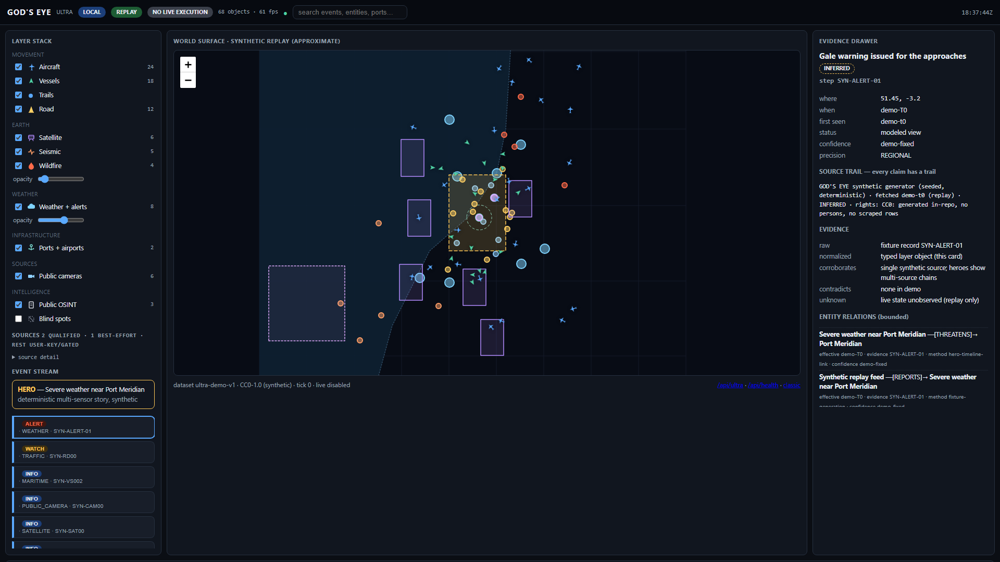
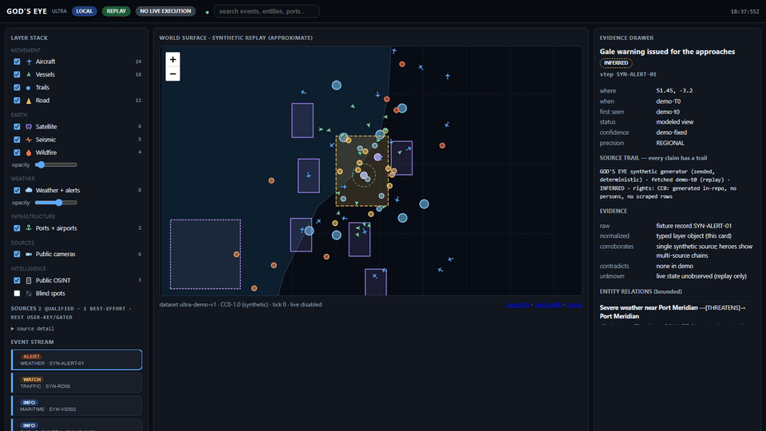
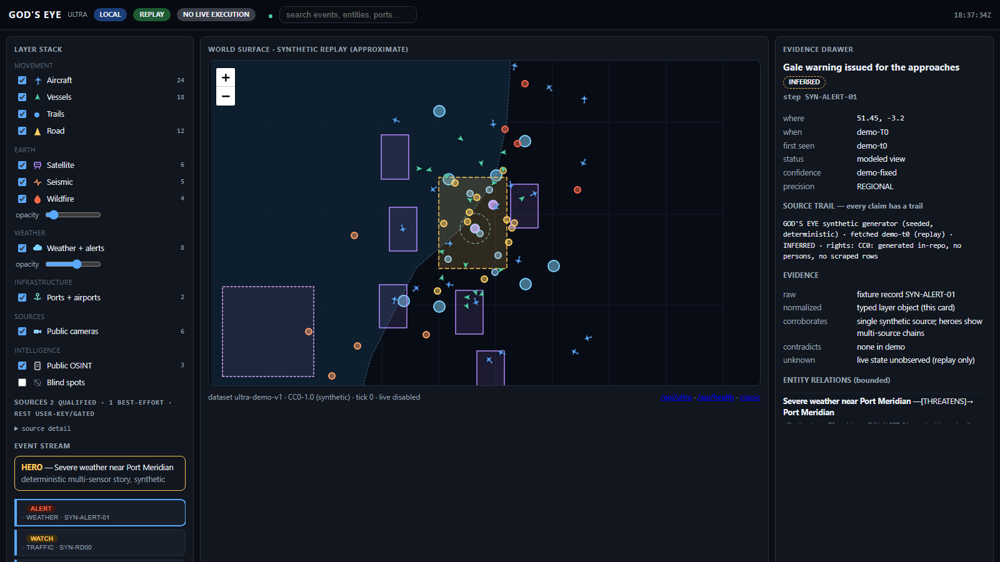

# Tellurion

**Open-source, local-first world intelligence.**


*Ultra demo, synthetic data — `godseye ultra --hero`. Watch the 32 s loop: *

Aircraft • Ships • Satellites • Weather • Traffic • Earth Events • Cameras • Evidence • Time Machine • Plugins

## Run it in 3 commands

```bash
pip install -e .
godseye doctor       # environment + boundary checks (no keys, no network)
godseye ultra --hero # localhost-only world surface -> http://127.0.0.1:8765/ultra?demo=hero
```

No API keys. No telemetry. No live execution. The demo runs fully offline
on synthetic CC0 datasets (`community-demo-v1`, `ultra-demo-v1`).

Turn lawful public sources into canonical world events — with provenance on
every record, evidence you can audit, entities you can trace, and a time
machine that shows what was known *when*.

## What it looks like

| Ultra world surface | Evidence drawer | Time machine |
|---|---|---|
|  |  |  |

Classic single-event demo still available: `godseye demo`
(`docs/screenshots/hero-world.png`). Open
`http://127.0.0.1:8765/ultra?demo=hero` for the deterministic
multi-sensor hero story (same vessels, weather, satellite pass, and
timeline on every run — ideal for screenshots). Plugin gallery at
`/gallery` (`docs/screenshots/ultra-gallery.png`).

## Ultra world surface (V18)

`http://127.0.0.1:8765/ultra` — the multi-sensor operations view:

AIRCRAFT · SHIPS · SATELLITES · WEATHER · WILDFIRE · SEISMIC ·
TRAFFIC · PUBLIC CAMERAS · PORTS · AIRPORTS · INFRASTRUCTURE ·
EVIDENCE · TIME MACHINE · PLUGINS

- Layer stack by group (movement / earth / infrastructure / events /
  sources / intelligence) with per-layer counts and health.
- Evidence-first drawer on every object: what / where / when /
  source / rights / observation / confidence / blind spots.
- Cross-sensor context: select a port event and see nearby vessels,
  weather, cameras, road pressure (proximity only, never inference).
- Time machine with replay ticks; deterministic hero story
  (`/ultra?demo=hero`: severe weather near Port Meridian) and a
  second airport story; density scene (`/ultra?demo=dense`).
- Plugin gallery at `/gallery`; source registry at `/api/plugins`.

All synthetic CC0 replay in the base demo. Live sources (USGS,
OpenSky, FIRMS, AIS) are opt-in, rights-gated plugins — never
bundled, never credentialed.

## Capabilities

- **World events** — canonical events from pluggable sensors (public data).
- **Evidence graph** — every record carries source, timestamp, and hash;
  observation vs inference is labelled, never blurred.
- **Entity relationships** — bounded neighbourhood views with method and
  model version on every edge — never a bare name.
- **Time machine** — replay historical belief vs current replay as-of any
  date; history is never rewritten.
- **Source health & blind spots** — coverage state is visible, including
  what is *not* observed and why. UNKNOWN stays UNKNOWN.
- **Market context** — generic venue contracts over synthetic replay data
  (no market claims, no execution).
- **Plugin ecosystem** — scaffold a sensor in a minute:
  `godseye new-plugin --kind sensor --name my-sensor --dir my_sensor`.

## Architecture

```
PUBLIC / LICENSED SOURCES
        v
PLUGINS (explicit install, explicit discovery)
        v
CANONICAL EVENTS
        v
EVIDENCE / ENTITY / WORLD STATE
        v
TIME MACHINE
        v
UI / APIs  (+ generic MARKET CONTEXT / EXECUTION REPLAY / PORTFOLIO)
```

See `docs/ARCHITECTURE.md` and `docs/TECH_STACK.md`.

## Plugin example

```python
from gods_eye.future import public_api as api

receipt = api.register_sensor(dict(
    name="my-sensor", version="0.1.0", kind="Sensor",
    license="MIT",
    data_rights="public-domain (synthetic CC0 fixture)",
    capabilities=["poll"], network="none", secrets="none",
    provenance="my_sensor (synthetic CC0)", health="ok",
    schema="plugin-v1",
))
print(receipt)  # production_qualified: True
```

Validate any plugin directory with actionable errors:

```bash
godseye plugins validate ./my_sensor
```

Full walkthrough: `examples/contributor_tasks/add_demo_sensor.md`.
Trust model: `docs/guides/plugin-trust-model.md`.

## Privacy, security, data rights

- Localhost-only demo; no outbound calls in community paths.
- Live execution is **disabled in code** (`ALLOW_LIVE=false`), not a flag.
- Software licences and data rights are separate rows; UNKNOWN rights
  never qualify for production. See `SECURITY.md`, `docs/guides/rights-policy.md`.

## Extending GOD'S EYE

GOD'S EYE is a platform. Build your own layers on top of it with the plugin
SDK (`gods_eye.plugins`) and extension slots (`gods_eye.future.extensions`).
The core never imports your code and runs without it (tested). See
`docs/OPEN_CORE_BOUNDARY.md`.

## Contributing & roadmap

See `CONTRIBUTING.md` and `docs/GOVERNANCE.md`. Near term: external plugin
pilot, human visual review, and the licence decision.

## License

**Proposed:** Apache License 2.0 (`legal/LICENSE.proposed`). Maintainer
sign-off has **not** been obtained yet (`legal/LICENSE_SIGNOFF.md`), so this
repository does not grant a licence today.
